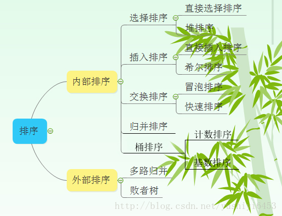

注：

1 归并排序可以通过手摇算法将空间复杂度降到O(1)，但是时间复杂度会提高。

2 基数排序时间复杂度为O(N*M)，其中N为数据个数，M为数据位数。

辅助记忆

时间复杂度记忆-
冒泡、选择、直接 排序需要两个for循环，每次只关注一个元素，平均时间复杂度为O(n²)）（一遍找元素O(n)，一遍找位置O(n)）
快速、归并、希尔、堆基于二分思想，log以2为底，平均时间复杂度为O(nlogn)（一遍找元素O(n)，一遍找位置O(logn)）
稳定性记忆-“快希选堆”（快牺牲稳定性）
排序算法的稳定性：排序前后相同元素的相对位置不变，则称排序算法是稳定的；否则排序算法是不稳定的。

参考：https://blog.csdn.net/pange1991/article/details/85460755